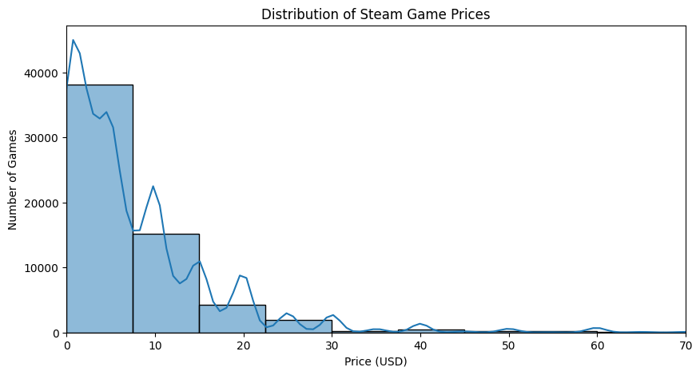

# Steam Game Market Analysis

## Business Context
PixelForge Studios is a mid-sized independent game development company planning to release a new PC game on Steam. Due to the highly competitive nature of the gaming market and the increasing number of annual releases, the company aims to base its upcoming product decisions on data-driven market insights.

As a data science consultant, the objective of this project is to analyze Steam market trends and provide actionable insights that can support pricing, positioning, and product strategy decisions for future game releases.

## Analytical Objectives
This analysis focuses on answering the following key questions:
- How has the Steam game market evolved over the last decade (2013–2023)?
- Which price ranges are most common and potentially favorable in terms of market performance?
- Is there a relationship between game price and user review scores?
- Do higher-priced or longer games receive better user feedback?
- How do successful games differ from average-performing titles?

## Dataset Overview
The dataset contains information on Steam games released between 2013 and 2023, including:
- Game titles and release dates
- Pricing information
- Estimated sales and ownership metrics
- Positive and negative user reviews
- Estimated playtime duration

The dataset is publicly available and suitable for exploratory market analysis.

## Methodology
The project applies exploratory data analysis techniques to:
- Clean and preprocess raw market data
- Analyze price distributions and market concentration
- Explore relationships between price, reviews, and popularity
- Compare characteristics of high-performing and typical games
- Visualize trends using statistical plots and charts

## Price Distribution on Steam
The following visualization shows the distribution of game prices on Steam. The market is heavily skewed towards low-priced and free-to-play titles, indicating strong competition in lower price segments.

## Key Insights
- The Steam market is dominated by low-priced and free-to-play titles
- Higher prices do not necessarily lead to better user review scores
- User engagement varies significantly across game genres
- Successful games tend to combine reasonable pricing with strong user feedback rather than high price alone

## Business Recommendations
Based on the analysis, the following strategic recommendations can be made for PixelForge Studios:
- Avoid high initial pricing for new releases unless supported by strong brand recognition
- Focus on value-driven pricing combined with quality user experience
- Monitor genre-specific trends rather than relying on overall market averages
- Use early user feedback as a key performance indicator post-release

## Tools & Technologies
- Python
- Pandas, NumPy
- Matplotlib, Seaborn
- Jupyter Notebook
